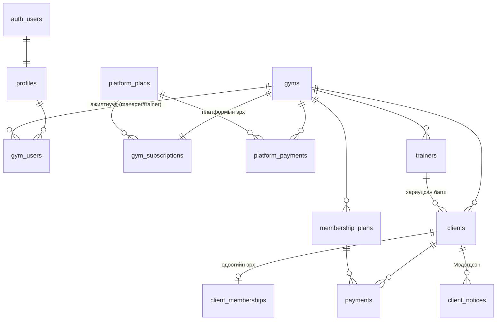

# Фитнес SaaS (MVP): төлөвлөгөө (батлагдсан 2026.09.19)

## Context
Монголын жижиг фитнесүүдэд зориулсан multi-tenant веб платформ. Фитнес бүр өөрөө бүртгүүлж, багш, үйлчлүүлэгч, багц, төлбөрөө бүртгэнэ. Менежер dashboard-аас эрх нь дуусах гэж буй үйлчлүүлэгчдээ хянана. Платформ фитнес бүрээс сарын ашиглалтын төлбөр авна.
Хавтас (`C:\Users\Issue\Desktop\gym`) одоогоор хоосон, git repo биш. Шинээр эхэлнэ.

**Таны сонголтууд:**
- Хөгжүүлэлтэд Docker Desktop дээр локал Supabase ажиллуулна. Production-д Supabase Cloud ашиглана.
- Багш төлбөр бүртгэж, эрх сунгаж болно. Орлогын нийлбэр, тайлан, багцын тохиргоо, платформын тохиргоог харахгүй.
- 2026.09.19-нд авсан 1 сарын эрх **2026.10.19-ний өдрийг дуустал** хүчинтэй. 10.20-нд дууссан гэж тооцогдоно.

**Кодлож эхлэхээс өмнө танаас хэрэгтэй зүйл:** Docker Desktop суулгаж (WSL2), асаасан байх.

---

## 1. Технологи ба хувилбар (2026.09.19-нд npm registry-ээс шалгасан)

| Технологи | Хувилбар | Тайлбар |
|---|---|---|
| Node.js | 24.13 LTS | Компьютерт суусан. supabase-js нь ≥22 шаарддаг |
| pnpm | 11.20 | Компьютерт суусан. npm-ээс хурдан, хамаарлыг илүү чанд шалгадаг |
| Next.js | **16.3.5** | App Router, Turbopack. `middleware.ts`-ийн оронд одоо **`proxy.ts`** ашигладаг |
| React | 19.3.0 | |
| TypeScript | **6.0.3** | Хамгийн сүүлийн stable нь 7.0.2 боловч энэ хувилбарт JS compiler API байхгүй. `typescript-eslint` нь зөвхөн `typescript <6.1.0`-ийг дэмждэг тул `eslint-config-next` 7.0.2 дээр ажиллахгүй. Тиймээс 6.0.3-ыг сонгосон: TS7 рүү шилжих гүүр хувилбар бөгөөд `typescript-eslint` дэмжмэгц 7 рүү шилжинэ |
| Tailwind CSS | 4.3.3 | CSS-first тохиргоо |
| shadcn CLI / radix-ui | 4.21.0 / 1.6.7 | Бүрэлдэхүүн хэсгүүдийн код төсөл дотор хуулагддаг тул монголоор чөлөөтэй өөрчилж болно |
| @supabase/supabase-js / @supabase/ssr | 2.116.0 / 0.12.7 | Шинэ `sb_publishable_…` / `sb_secret_…` түлхүүр ашиглана. Хамгаалалтад `getClaims()` хэрэглэнэ |
| Supabase CLI | 2.117.0 | devDependency. Локал Postgres 17, Auth, Studio, Mailpit өгнө |
| Zod | 4.6.5 | Client ба server нэг схем хуваалцана |
| react-hook-form / @hookform/resolvers | 7.88.0 / 5.9.1 | |
| date-fns / @date-fns/tz | 4.4.0 / 1.5.0 | Asia/Ulaanbaatar цагийн бүс |
| Vitest | 5.0.1 | Unit тест. `pg` ашигласан DB/RLS тест |
| ESLint | 10.11 | Flat config + eslint-config-next |
| lucide-react, sonner | 1.47, 2.0.8 | Icon, toast мэдэгдэл |

**Санал болгосон stack-ийг хэвээр авна.** Supabase-д RLS, Auth, Storage, урилгын имэйл бэлэн байгаа. Next.js Server Actions нь тусдаа API давхарга бичих хэрэгцээг арилгадаг. Тусдаа backend нэмэх нь MVP-д илүүц болно.
i18n сан хэрэглэхгүй: интерфэйс зөвхөн монгол хэлтэй. Фонт нь Inter (`latin`, `cyrillic`, `cyrillic-ext`). Ө, Ү үсэг `cyrillic-ext` subset-д байдаг.

---

## 2. Архитектурын гол шийдвэрүүд
1. **Хамгаалалт 4 давхар.** `proxy.ts` session-ийг шинэчилж, нэвтрээгүй хэрэглэгчийг `/login` руу чиглүүлнэ. Layout-ууд `getAppContext()`-оор дүрийг шалгана. Server Action бүр Zod-оор оролтыг шалгаж, дүрийг дахин шалгана. Эцсийн хамгаалалт нь **Postgres RLS**. Дээд давхаргууд алдсан ч өгөгдөл өөр фитнест харагдахгүй.
2. **Tenant бүрэн бүтэн байдал.** Бүх хүснэгтэд `gym_id` байна. Хүснэгтүүдийн холбоос нь **нийлмэл FK** (`(gym_id, client_id) → clients(gym_id, id)`). Ингэснээр А фитнес өөрийн `gym_id`-тай мөрөнд Б фитнесийн үйлчлүүлэгчийг холбож чадахгүй. `gym_id`-г өөрчлөхийг trigger хориглоно.
3. **Эмзэг талбарууд тусдаа хүснэгтэд.** Платформын эрх (`gym_subscriptions`) болон үйлчлүүлэгчийн эрхийн хугацаа (`client_memberships`) тусдаа хүснэгтэд байна. Хэрэглэгч эдгээрийг зөвхөн уншина. Өөрчлөлт зөвхөн `SECURITY DEFINER` RPC-ээр хийгдэнэ. Жишээ нь багш API-аар шууд дуусах огноо сунгаж чадахгүй.
4. **Төлөвийг огнооноос тооцоолно.** `trial/active/past_due/suspended` болон үйлчлүүлэгчийн төлөвийг хадгалахгүй, огнооноос тооцоолно. Cron шаардлагагүй тул төлөв хэзээ ч хоцрохгүй.
5. **Read-only горимыг DB түвшинд хэрэгжүүлнэ.** Бичих бүх RLS бодлого болон RPC `app.gym_is_writable(gym_id)`-ийг шалгана. UI дээр banner гарч, товчнууд идэвхгүй болно.
6. **Hard delete хийх боломжгүй.** `anon` болон `authenticated`-аас `DELETE` эрхийг бүх хүснэгтэд хураана. Устгах нь `deleted_at`, `voided_at` эсвэл `is_active=false` болгох явдал.
7. **Огноо.** Бизнесийн огноонууд `date` төрөлтэй (`paid_on`, `ends_on`). "Өнөөдөр"-ийг `app.today_ub()` = `(now() at time zone 'Asia/Ulaanbaatar')::date`-ээр тодорхойлно. UI-д `YYYY-MM-DD`-г шууд `YYYY.MM.DD` болгоно. `new Date('2026-09-19')` UTC-ээр шилжих алдаа гаргадаг тул хэрэглэхгүй.
8. **Мөнгө.** Дүнг `bigint` бүхэл ₮-өөр хадгална. Харуулахдаа `formatMNT(1250000)` → `1,250,000₮`.

---

## 3. Өгөгдлийн сангийн схем (ER)



**Enum-ууд:** `staff_role(manager, trainer)`, `gym_subscription_status(trial, active, past_due, suspended)`, `payment_method(cash, bank_transfer, qpay)` (`qpay`-ийг одооноос нэмсэн, UI-д харуулахгүй), `discount_type(none, amount, percent)`, `gender(male, female)`, `client_membership_status(active, expiring, expired, none)`.

| Хүснэгт | Гол баганууд |
|---|---|
| `profiles` | `id` (=auth.users), `full_name`, `phone`, `is_platform_admin` (зөвхөн SQL/скриптээр тохируулна) |
| `gyms` | `id`, `name`, `address`, `phone`, `logo_path`, `expiring_threshold_days` (анхдагч 7, 1–60), `created_at` |
| `gym_users` | `gym_id`, `user_id`, `role`, `is_active`. Нэвтрэх эрхийн цорын ганц эх сурвалж, unique(gym_id, user_id) |
| `gym_subscriptions` | `gym_id` (PK), `platform_plan_id`, `trial_ends_at`, `paid_until`, `suspended_at`, `verified_at` |
| `platform_plans` | `name`, `max_clients` (null = хязгааргүй), `monthly_price`, `is_active`, `sort_order` |
| `platform_payments` | `gym_id`, `platform_plan_id`, `months`, `amount`, `paid_on`, `method`, `period_start`, `period_end`, `recorded_by`, `note`, `voided_at` |
| `trainers` | `gym_id`, `full_name`, `phone`, `specialization`, `notes`, `email`, `user_id` (урьсны дараа), `invited_at`, `is_active` |
| `clients` | `gym_id`, `full_name`, `phone` (check `^\d{8}$`), `gender`, `birth_year` (1920–одоо), `assigned_trainer_id` (заавал биш), `notes`, `created_by`, `deleted_at` |
| `membership_plans` | `gym_id`, `name`, `duration_months` (>0), `price`, `is_active`, `sort_order`, `deleted_at` |
| `payments` | `gym_id`, `client_id`, `plan_id` + snapshot (`plan_name`, `duration_months`, `list_price`), `discount_type`, `discount_value`, `discount_amount`, `amount`, `paid_on`, `method`, `starts_on`, `ends_on`, `is_renewal`, `recorded_by`, `note`, `voided_at/by/reason` |
| `client_memberships` | `client_id` (PK), `gym_id`, `starts_on`, `ends_on`, `last_payment_id`, `last_plan_name`. RPC л шинэчилнэ |
| `client_notices` | `gym_id`, `client_id`, `ends_on` (аль эрхийн мөчлөгт хамаарах), `notified_at`, `notified_by`, `note`, `deleted_at` |
| view `client_status_v` | `security_invoker`. `clients` + `client_memberships` + `days_left` + `status` + багшийн нэр + тухайн мөчлөгийн "Мэдэгдсэн" тэмдэглэл |

Бүх хүснэгтэд `created_at` ба `updated_at` байна. Индексүүд: `(gym_id, deleted_at)`, `clients(gym_id, phone)`, `client_memberships(gym_id, ends_on)`, `payments(gym_id, paid_on)`.

### Бизнесийн логик (SQL функц нь цорын ганц эх сурвалж)
**Эрхийн хугацаа** (`app.compute_period(current_end, paid_on, months)`):
- `current_end >= paid_on` бол эрх идэвхтэй (тухайн өдөр дуусах ч орно). Тэгвэл `starts_on = current_end + 1`, `ends_on = current_end + N сар`.
- Бусад тохиолдолд `starts_on = paid_on`, `ends_on = paid_on + N сар`.
- Жишээ: 09.19-нд 1 сар авбал 10.19 хүртэл. 10.10-нд сунгавал 10.20-оос 11.19 хүртэл. 01.31-нд 1 сар авбал 02.28 хүртэл (Postgres/date-fns сарын сүүлийн өдрөөр тасалдаг).

**`record_payment` RPC:** Үйлчлүүлэгчийн мөрийг `FOR UPDATE`-ээр түгжинэ. Хөнгөлөлтийг бодно: хувь бол 0–100 хооронд ₮-өөр бүхэлтгэнэ, дүн бол багцын үнээс хэтрэхгүй. `is_renewal`-ийг тодорхойлж, `payments` ба `client_memberships`-ийг атомаар бичнэ. `paid_on` ирээдүйн огноо байж болохгүй.
**`void_payment` (зөвхөн менежер):** Зөвхөн хамгийн сүүлийн төлбөрийг хүчингүй болгоно. Дараа нь эрхийг өмнөх төлбөрөөр нь сэргээнэ. Ингэснээр гинжин тооцоолол эвдрэхгүй.
Маягт дээрх "Шинэ дуусах огноо"-ны урьдчилсан харагдацад ижил логикийг TS-ээр давтана. SQL болон TS хоёр хувилбарыг **ижил тест кейсүүдээр** шалгаж, үр дүн нь зөрөхгүй гэдгийг баталгаажуулна.

**Үйлчлүүлэгчийн төлөв** (T = өнөөдөр, D = фитнесийн тохируулсан хоног):
- `none`: төлбөр огт байхгүй.
- `expired`: `ends_on < T`.
- `expiring`: `T ≤ ends_on ≤ T+D`, `days_left = ends_on − T` (0 бол "Өнөөдөр дуусна").
- `active`: үлдсэн бүх тохиолдол.
- "Идэвхтэй" тоонд `active` ба `expiring` хоёулаа орно.

**Платформын төлөв** (`app.gym_status`):
- `suspended_at` утгатай бол `suspended`.
- `paid_until ≥ T` бол `active`.
- `trial_ends_at ≥ T` бол `trial`.
- Бусад тохиолдолд `past_due`.
- Бүртгүүлэхэд `trial_ends_at = T + 14`.
- Админ төлбөр бүртгэхэд эрхийн хугацааг дээрх `compute_period`-оор тооцно. Суурь огноо нь `greatest(trial_ends_at, paid_until)`, өөрөөр хэлбэл туршилтын үеэр төлбөл туршилт дууссаны дараагаас сунгана.
- `past_due` эсвэл `suspended` бол read-only горимд шилжинэ.
- Эрх дуусахад ≤5 хоног үлдсэн бол менежерт анхааруулга харуулна. Анхааруулгад дансны мэдээлэл орно.

### Нэвтрэлтийн урсгал
- **Фитнес бүртгэл:** `/register` маягтыг Zod шалгасны дараа `auth.signUp`-ийг metadata-тай дуудна. `auth.users` дээрх trigger нь `profiles`, `gyms`, `gym_users(manager)`, `gym_subscriptions(trial)`-ийг нэг транзакцаар үүсгэнэ. Admin эрхийг metadata-аас хэзээ ч уншихгүй. Лого сонгосон бол server action нь secret key-ээр Storage `gym-logos/{gym_id}/` руу байршуулна. Хэрэглэгч имэйлээ баталгаажуулсны дараа `/dashboard` руу орно.
- **Багш урих:** Менежер багшийн мэдээллээ хадгалаад "Нэвтрэх эрх олгох" товч дарна. Server action менежер мөн эсэхийг шалгаад `auth.admin.inviteUserByEmail`-ийг дуудна. Дараа нь `gym_users(trainer)` мөр үүсгэж, `trainers.user_id`-г холбоно. Багш имэйлийн холбоосоор `/auth/confirm` руу ороод `/set-password` хуудсанд нууц үгээ тохируулна. Багшийг идэвхгүй болгоход trigger `gym_users.is_active=false` болгож, нэвтрэх эрх нь шууд хаагдана.
- **Имэйл загварууд:** Баталгаажуулах, урилга, нууц үг сэргээх загварыг монголоор `supabase/templates/`-д бэлдэнэ. Локал орчинд Mailpit (`http://127.0.0.1:54324`) имэйлүүдийг барина.

---

## 4. RLS бодлого
Туслах функцууд нь `app` schema-д байна (PostgREST-ээр ил гарахгүй). `SECURITY DEFINER`, `STABLE`, `search_path=''` тохиргоотой. Policy дотор `(select ...)`-ээр ороож, нэг query-д нэг л удаа ажиллуулна.
`app.is_platform_admin()`, `app.is_gym_member(gym)`, `app.is_gym_manager(gym)`, `app.gym_is_writable(gym)`, `app.gym_status(gym)`, `app.today_ub()`

Тэмдэглэгээ: **M** = менежер, **T** = багш (тухайн фитнесийн идэвхтэй ажилтан), **A** = платформын админ, **W** = фитнес бичих эрхтэй (trial/active). DELETE бүх хүснэгтэд хориотой.

| Хүснэгт | SELECT | INSERT | UPDATE |
|---|---|---|---|
| profiles | өөрийн, хамт ажилладаг ажилтнууд, A | trigger | өөрийн (нэр, утас) |
| gyms | M, T, A | trigger | M+W |
| gym_users | өөрийн мөр, M, A | server (урилга) | trigger (багш идэвхгүй болоход) |
| gym_subscriptions | M, T, A | trigger | зөвхөн A-ийн RPC |
| trainers | M, T | M+W | M+W |
| clients | M, T | M, T +W | M, T +W. `deleted_at`-ийг зөвхөн M өөрчилнө (trigger шалгана) |
| membership_plans | M, T | M+W | M+W |
| payments | **зөвхөн M** | `record_payment` RPC (M, T +W) | `void_payment` RPC (M+W) |
| client_memberships | M, T | RPC | RPC |
| client_notices | M, T | M, T +W | M, T +W (буцаах) |
| platform_plans | нэвтэрсэн бүх хэрэглэгч (идэвхтэй), A (бүгд) | A | A |
| platform_payments | тухайн фитнесийн M, A | A-ийн RPC | A-ийн RPC (хүчингүй болгох) |
| gym_profiles | M, T, A. Нэвтрээгүй хүн **зөвхөн RPC-ээр** | M+W | M+W |

- Багш `payments` хүснэгтийн мөрүүдийг **уншиж чадахгүй**, тиймээс API-аар ч орлогыг нийлбэрлэж чадахгүй. Багш эрхийн хугацаа, сүүлийн багцын нэрийг `client_memberships`-ээс харна.
- Админ үйлчлүүлэгчийн хувийн мэдээллийг **харахгүй**. Зөвхөн `admin_gym_overview()` RPC-ээр фитнес тус бүрийн тоон мэдээллийг авна.
- Бүх RPC-ээс `anon` эрхийг хураана.

---

## 5. Хавтасны бүтэц
```
gym/
├─ .env.example              # хувьсагч бүрийн тайлбартай
├─ README.md                 # монголоор: локал орчин, тест, deploy
├─ docs/PLAN.md              # энэ төлөвлөгөө (батлагдсаны дараа)
├─ package.json  next.config.ts  tsconfig.json  eslint.config.mjs  vitest.config.ts  components.json
├─ supabase/
│  ├─ config.toml            # site_url, redirect URL, имэйл загвар
│  ├─ templates/             # confirmation.html, invite.html, recovery.html (монгол)
│  └─ migrations/            # 01_foundation, 02_clients_trainers, 03_plans_payments, 04_dashboard, 05_platform_billing
├─ scripts/  seed.ts  make-admin.ts
├─ src/
│  ├─ proxy.ts               # session шинэчлэх, чиглүүлэх
│  ├─ app/
│  │  ├─ (public)/           # нүүр хуудас
│  │  ├─ (auth)/             # login, register, forgot-password, set-password
│  │  ├─ auth/confirm/route.ts
│  │  ├─ (app)/              # фитнесийн хэсэг: layout = app shell + read-only banner
│  │  └─ admin/              # платформын админ
│  ├─ components/ui/         # shadcn
│  ├─ components/            # page-header, status-badge, money-input, mobile-nav, empty-state…
│  ├─ features/<feature>/    # auth, clients, trainers, plans, payments, dashboard, billing, admin
│  │     ├─ schemas.ts (Zod)  actions.ts (Server Actions)  queries.ts  components/
│  ├─ lib/
│  │  ├─ supabase/ server.ts client.ts admin.ts(server-only) proxy.ts
│  │  ├─ context.ts          # getAppContext(): user, дүр, фитнес, төлөв, бичих эрх (нэг RPC)
│  │  ├─ dates.ts  money.ts  phone.ts  membership.ts
│  │  └─ zod-mn.ts           # монгол алдааны мессеж
│  └─ types/database.types.ts  # supabase gen types
└─ tests/
   ├─ unit/                  # membership, discount, phone, format
   └─ db/                    # pg + локал Supabase: rls-isolation, roles, read-only, payments, platform-status
```

---

## 6. Хуудсууд
| Зам | Хэн | Агуулга |
|---|---|---|
| `/` | бүгд | Танилцуулга, тарифууд, "Бүртгүүлэх" |
| `/gyms` | бүгд | Фитнес хайх: нэр/хаягаар хайх, дүүргээр шүүх, "Ойролцоох" (хөтөч дээр зайгаар эрэмбэлэх), газрын зураг |
| `/gyms/[slug]` | бүгд | Фитнесийн нийтийн хуудас: зураг, үнэ, цагийн хуваарь, үйлчилгээ, байршил, "Залгах", "Чиглэл авах" |
| `/register`, `/register/check-email` | бүгд | Фитнес бүртгүүлэх (лого заавал биш) |
| `/login`, `/forgot-password`, `/set-password` | бүгд | Нэвтрэх, нууц үг сэргээх, урилгаар нууц үг тохируулах |
| `/dashboard` | M, T | Үзүүлэлтийн картууд: идэвхтэй тоо, энэ сарын орлого (зөвхөн M), шинэ ба сунгасан тоо. **Дуусах гэж буй** жагсаалт үлдсэн хоногоор эрэмбэлэгдэж өнгөөр ялгагдана (0–2 хоног: улаан, 3–D: улбар шар). **Дууссан** жагсаалт сүүлийн 30 хоногийг харуулж, "Бүгдийг харах" холбоостой. Мөр бүрт "Мэдэгдсэн" товч (огноо, тэмдэглэл, буцаах) болон "Төлбөр / Сунгах" товч байна. Платформын эрх дуусахад ≤5 хоног үлдвэл анхааруулга гарна |
| `/clients` | M, T | Нэр, утсаар хайх. Төлөв, багшаар шүүх. Хуудаслалттай. Утсан дээр карт хэлбэрээр харагдана |
| `/clients/new`, `/clients/[id]/edit` | M, T | Үйлчлүүлэгчийн маягт |
| `/clients/[id]` | M, T | Дэлгэрэнгүй, одоогийн эрх, "Мэдэгдсэн" түүх. Төлбөрийн түүх зөвхөн M-д харагдана. Устгах (soft) товч зөвхөн M-д |
| `/clients/[id]/pay` | M, T | Багц, огноо, арга, хөнгөлөлт сонгоно. Эцсийн дүн ба шинэ дуусах огноо шууд тооцоологдож харагдана |
| `/payments` | M | Сараар шүүх, нийт дүн, хүчингүй болгох |
| `/plans` | M | Эрхийн багцууд (нэмэх, засах, архивлах) |
| `/trainers`, `/trainers/new`, `/trainers/[id]` | M | Багшийн бүртгэл, урилга, идэвхгүй болгох |
| `/settings` | M | Фитнесийн мэдээлэл, лого, "дуусах гэж буй" хоногийн тохиргоо |
| `/listing`, `/listing/preview` | M | Нийтийн танилцуулга засах (байршил газрын зураг дээр, зураг, цаг, үйлчилгээ), урьдчилан харах |
| `/billing` | M | Платформын эрхийн төлөв, дуусах огноо, тариф, дансны мэдээлэл, төлбөрийн түүх |
| `/account` | M, T | Өөрийн нэр, утас, нууц үг |
| `/admin` | A | Нийт фитнес (төлөв тус бүрээр), энэ сарын орлого, MRR, төлбөр хоцорсон фитнесүүд |
| `/admin/gyms`, `/admin/gyms/[id]` | A | Жагсаалт: төлөв, дуусах огноо, үйлчлүүлэгчийн тоо ба тарифын хязгаар. Баталгаажуулах, түр зогсоох, сэргээх, төлбөр бүртгэх |
| `/admin/plans`, `/admin/payments` | A | Тарифууд, платформын бүх төлбөр |

Утсан дээр доод навигацтай (Хяналт, Үйлчлүүлэгч, Төлбөр, Цэс). Компьютер дээр хажуугийн цэстэй. Товчнууд дор хаяж 44px өндөртэй, мөнгөн дүнгийн талбар бичих явцад `1,250,000` хэлбэрээр форматлагдана.

---

## 7. Үе шатууд
Үе шат бүрийн төгсгөлд: `lint`, `typecheck`, тестүүд, `build` ажиллуулна. Дараа нь browser pane дээр (375px утасны өргөн болон компьютерийн өргөнөөр) гол урсгалуудыг шалгаад товч тайлан өгнө. Git repo үүсгэж, үе шат бүрийг commit хийнэ.

0. **Суурь:** Next 16 scaffold, Tailwind + shadcn, ESLint, Vitest, `supabase init` ба `config.toml`, `.env.example`, `money`/`dates`/`phone` туслах функцууд ба тэдгээрийн unit тест.
1. **Auth ба multi-tenant суурь:** migration 01 (enum-ууд, profiles, gyms, gym_users, gym_subscriptions, platform_plans, `app.*` функцууд, signup trigger, storage bucket). `proxy.ts`, Supabase client-ууд, `getAppContext`. Бүртгүүлэх, нэвтрэх, баталгаажуулах, нууц үг сэргээх хуудсууд. App shell ба read-only banner. RLS тестийн суурь. *Шалгах зүйл: бүртгүүлэх, Mailpit-ээр баталгаажуулах, хоосон dashboard; хоёр фитнесийн тусгаарлалтын тест.*
2. **Үйлчлүүлэгч ба багш:** migration 02. Багшийн CRUD, урилга, идэвхгүй болгох. Үйлчлүүлэгчийн CRUD, хайлт, шүүлт, soft delete. *Тест: tenant хооронд нийлмэл FK-г хуурах оролдлого, багш ба менежерийн эрхийн ялгаа.*
3. **Багц ба төлбөр:** migration 03. Багцын CRUD, `record_payment`/`void_payment`, төлбөрийн маягт, төлбөрийн жагсаалт. *Тест: хугацаа тооцох SQL ба TS-ийн нийцэл (сунгалт, дууссан эрх, сарын сүүлийн өдөр, өндөр жил), хөнгөлөлт, багш payments-ийг уншиж чадахгүй байх.*
4. **Dashboard:** migration 04 (`client_status_v`, `client_notices`, summary RPC). Dashboard UI, "Мэдэгдсэн", мөрөөс шууд төлбөр бүртгэх, "дуусах гэж буй" хоногийн тохиргоо.
5. **Платформын төлбөр ба админ:** migration 05 (platform_payments, admin RPC). `/billing`, 5 хоногийн анхааруулга, read-only UI, админ самбар, `make-admin` скрипт. Эцсийн seed, README, бүх тестийг бүтнээр нь ажиллуулна. *Тест: read-only фитнесийн бичих үйлдэл бүгд хаагдах, платформын төлөвийн шилжилт.*

**Seed (`pnpm db:seed`)** нь үе шат бүрт өргөжинө. Бүх огноог "өнөөдөр"-өөс харьцангуйгаар тооцдог тул хэзээ ч ажиллуулсан бүх төлөв гарч ирнэ. Production-оос хамгаалахын тулд зөвхөн localhost URL дээр ажиллана.
- Админ хэрэглэгч.
- Платформын 3 тариф: Эхлэл ≤100 үйлчлүүлэгч, Стандарт ≤300, Про хязгааргүй. Үнийг жишээ байдлаар оруулна, админ дараа нь засна.
- 2 фитнес. Нэг нь `active` төлөвтэй. Нөгөө нь `trial` төлөвтэй бөгөөд туршилт дуусахад 4 хоног үлдсэн тул анхааруулга харагдана.
- Фитнес бүрт менежер 1, багш 3 (үүнээс 2 нь нэвтрэх эрхтэй), багц 4 (1, 3, 6, 12 сар).
- Фитнес бүрт 40 үйлчлүүлэгч: ойролцоогоор 20 идэвхтэй, 8 дуусах гэж буй (0–7 хоног үлдсэн), 8 дууссан, 4 төлбөргүй. Зарим нь сунгалт, хөнгөлөлт, "Мэдэгдсэн" тэмдэглэлтэй.
- Монгол нэрс, 8 оронтой утасны дугаартай.

---

### 6. Фитнесийн нийтийн танилцуулга ба хайлт (2026.09.21)
Хэрэглэгчийн хүсэлт: фитнесүүд өөрийн мэдээлэл, үнэ, байршлаа оруулж, үйлчлүүлэгчид өөрт ойр фитнесийг олдог байх.
- **Migration 06** (`gym_profiles`, `gym-photos` bucket, `list_public_gyms` / `get_public_gym` RPC).
- **Нийтэд юу харагдах вэ.** Нэвтрээгүй хүн хүснэгтийг шууд уншихгүй, зөвхөн хоёр `SECURITY DEFINER` RPC-ээр
  нийтийн баганыг авна (үйлчлүүлэгч, ажилтан, орлого, имэйл гарахгүй — тест баганын жагсаалтыг шалгадаг).
- **Жагсаалтад гарах нөхцөл** (`app.listed_gym_ids`): менежер нийтэлсэн + админ баталгаажуулсан (`verified_at`,
  хуурамч бүртгэлээс хамгаална) + платформын эрх `trial`/`active`. Эрх дуусвал автоматаар нуугдана.
- **Байршил.** Менежер газрын зураг дээр заана (OpenStreetMap + Leaflet, API түлхүүргүй). Дүүрэг/аймаг (9 дүүрэг,
  21 аймаг) нь шүүлтүүрт. "Ойролцоох" нь хэрэглэгчийн байршлыг **хөтөч дээр** ашиглаж зайгаар эрэмбэлнэ: серверт
  илгээхгүй. Нийтлэхэд байршил, дүүрэг заавал (DB check).
- **Үнэ** эрхийн багцаас (`membership_plans`) автоматаар. Менежер нууж болно. Жагсаалтад 1 сарын хамгийн хямд үнэ.
- **Зураг** 8 хүртэл. Хөтөч дээр 1600px JPEG болгож багасгаад Storage руу (RLS: өөрийн фитнесийн хавтас).
  `photo_paths` нь өөр фитнесийн файлыг заахаас DB check хамгаална.
- **Цагийн хуваарь** 7 өдөр, `{mon: ["07:00","22:00"] | null}`. "Одоо нээлттэй"-г хөтөч дээр УБ-ын цагаар тооцно
  (кэшлэгдсэн HTML-д хуучин төлөв үлдэхгүй).
- **Кэш.** `/gyms` ба `/gyms/[slug]` нь ISR (5 минут). Танилцуулга, багц, баталгаажуулалт, платформын эрх
  өөрчлөгдөхөд `revalidateDirectory()` шууд шинэчилнэ (route group-тэй зам: `/(public)/gyms`, "layout").
- **Seed:** жишээ 7 фитнес + үндсэн хоёр фитнесийн танилцуулга ("Эрч хүч" нь баталгаажуулалт хүлээж буй төлөвтэй).
  Cloud-д: `pnpm cloud:demo` (утасгүй, нэвтрэх эрхгүй менежертэй, `--unpublish`-ээр нууна).

## 8. Тест ба шалгалт
- `pnpm test`: unit тестүүд (Docker шаардлагагүй). Хугацаа тооцоолол, хөнгөлөлт, утасны дугаар normalize (+976, зай, зураас), `1,250,000₮` ба `2026.09.19` формат, UB цагийн бүсийн шөнө дундын заагийн тохиолдлууд.
- `pnpm test:db`: локал Supabase Postgres дээр `pg`-ээр ажиллана.
  - Тест бүр транзакц дотор хэрэглэгч үүсгээд `set local role authenticated` болон `request.jwt.claims` тохируулна. Төгсгөлд нь `rollback` хийнэ.
  - Шалгах зүйлс: tenant хоорондын SELECT/INSERT/UPDATE хүсэлт хаагдах, өөр фитнесийн `gym_id`-г ашиглах болон нийлмэл FK-г хуурах оролдлого, `anon` хэрэглэгч юу ч харахгүй байх, DELETE хориотой байх, багш ба менежерийн эрхийн ялгаа, past_due болон suspended фитнесийн read-only горим, admin RPC-ийн эрх, `record_payment`-ийн тооцоолол.
- `pnpm lint`, `pnpm typecheck`, `pnpm build`.
- Гараар шалгах урсгал:
  1. Фитнес бүртгүүлэх.
  2. Mailpit-ээр имэйл баталгаажуулах.
  3. Багц үүсгэх.
  4. Үйлчлүүлэгч нэмэх.
  5. Төлбөр бүртгэх, сунгах.
  6. Dashboard-аас "Мэдэгдсэн" тэмдэглэх.
  7. Багш урих, багшаар нэвтрэхэд орлого харагдахгүй байх.
  8. Админаас фитнесийг түр зогсооход read-only болох.
  9. Хоёр дахь фитнесээр нэвтрэхэд эхний фитнесийн өгөгдөл харагдахгүй байх.

## 9. Deploy (README-д дэлгэрэнгүй)
- **Supabase Cloud:** Ойрхон бүс болох Seoul эсвэл Tokyo-г сонгоно. `supabase link` → `supabase db push`. Auth Site URL болон redirect URL-уудыг тохируулна. Монгол имэйл загваруудыг хуулна.
- **Имэйл:** Өөрийн SMTP (жишээ нь Resend) заавал тохируулна. Supabase-ийн анхдагч SMTP нь урилгын имэйлийг бусад хаягт илгээхгүй.
- **Vercel:** Бүс нь `icn1` (Seoul). Орчны хувьсагчдыг оруулна. `make-admin` скриптээр анхны админыг үүсгэнэ.
- **Санамж:** Үйлчлүүлэгчийн хувийн мэдээлэл гадаадын сервер дээр хадгалагдана. Хувь хүний мэдээлэл хамгаалах тухай хуулийн шаардлагыг хууль зүйн талаас нэг шалгуулах нь зүйтэй.

## 10. Таамаглал (өөрчлөх бол хэлээрэй)
- Админы баталгаажуулалт (`verified_at`) нь фитнесийн ажиллагааг **хаахгүй**, зөвхөн тэмдэглэл. Бүртгүүлмэгц туршилт шууд эхэлнэ.
- `suspended` бол админ гараар түр зогсоосон гэсэн үг. `past_due` нь эрх дуусаад төлөгдөөгүй гэсэн үг. Хоёулаа read-only горимд шилжих бөгөөд banner-ийн мессеж нь өөр байна.
- Тарифын үйлчлүүлэгчийн хязгаарыг **хатуу хаахгүй**. Зөвхөн менежер болон админд анхааруулга харуулна.
- Нэг хэрэглэгч нэг фитнест харьяалагдана. Схем нь олон фитнест харьяалагдахыг дэмжих боловч UI-г хийхгүй.
- Багш үйлчлүүлэгчийг засаж болно, харин устгах эрхгүй.
- Нэг утасны дугаараар хэд хэдэн үйлчлүүлэгч бүртгэж болно (жишээ нь эцэг эхийн дугаар). Давхардлыг хориглохгүй.
- Платформын дансны мэдээллийг env хувьсагчаар тохируулна.

## 11. Энэ шатанд хийхгүй
Мобайл апп, QPay интеграц, SMS/Messenger сануулга, ирц бүртгэл, үйлчлүүлэгчийн нэвтрэлт.
Фитнес хайх хэсэгт: үнэлгээ, сэтгэгдэл, онлайн бүртгэл/төлбөр, хичээлийн хуваарь хийгдээгүй.

---
Эх сурвалж: [Supabase: Next.js SSR auth](https://supabase.com/docs/guides/auth/server-side/nextjs), [Next.js 16: proxy.ts](https://nextjs.org/docs/app/api-reference/file-conventions/proxy), [Next.js: TypeScript config](https://nextjs.org/docs/app/api-reference/config/typescript), [TS 7 ба typescript-eslint нийцлийн асуудал](https://github.com/navikt/copilot/issues/853)
